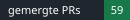
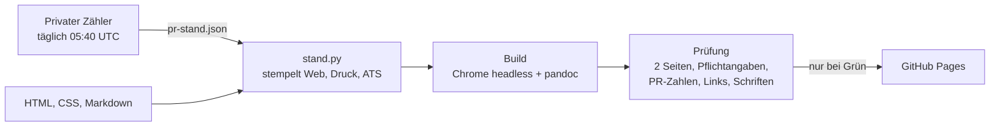

# Jason Roschmann – Lebenslauf

[](https://github.com/JasonRoschmann/cv/actions/workflows/pruefung.yml)
[](https://jasonroschmann.github.io/cv/#github)

Mein Lebenslauf als Web-App und in Druck- und ATS-Fassungen – aus denselben Quellen gebaut, bei jeder Änderung geprüft, die PR-Zahlen zählen sich täglich selbst.

**[Web-CV](https://jasonroschmann.github.io/cv/)** ·
[Lebenslauf DE (PDF)](https://jasonroschmann.github.io/cv/Jason_Roschmann_CV.pdf) ·
[CV EN (PDF)](https://jasonroschmann.github.io/cv/Jason_Roschmann_CV_EN.pdf) ·
[Marketing-Fassung (PDF)](https://jasonroschmann.github.io/cv/Jason_Roschmann_CV_Marketing.pdf) ·
[Belegmappe: drei Shop-Fälle (PDF)](https://jasonroschmann.github.io/cv/Jason_Roschmann_Belegmappe.pdf) ·
[ATS DE](https://jasonroschmann.github.io/cv/ats-cv/Jason_Roschmann_CV_ATS.pdf) /
[EN](https://jasonroschmann.github.io/cv/ats-cv/Jason_Roschmann_CV_ATS_EN.pdf)

## Ablauf



- **Bei jedem Pull Request und täglich** baut [`pruefung.yml`](.github/workflows/pruefung.yml) alle PDFs frisch unter Linux und prüft sie mit [`cv_pruefung.py`](scripts/cv_pruefung.py).
- **Nach jedem Push auf `main`** stempelt [`stand.yml`](.github/workflows/stand.yml) die Zahlen, baut die PDFs nur bei geänderten Druckquellen neu (Prüfsumme in `pdf-quellen.sha256`) und committet nur, wenn die Prüfung grün ist.
- **Täglich** aktualisiert [`proof.yml`](.github/workflows/proof.yml) Heatmap und Ship-Feed der Web-Seite (`proof.json`).

## Wie die PR-Zahl entsteht

- **Gezählt** werden Pull Requests, die ich verfasst habe und die gemergt wurden – über die GitHub-Suche `author:JasonRoschmann is:pr is:merged`, private Repositories eingeschlossen. Keine Reviews, keine Commits, keine Hochrechnung.
- **Aufgeteilt** nach Flowki Studio (Teamprojekt), eigenen Repos und Kundenprojekten; `pr-stand.json` enthält nur diese Zahlen und den Verlauf je Tag.
- **Nie veröffentlicht:** Namen privater Repositories, PR-Titel, Links und Kundennamen. Die Zählung läuft außerhalb dieses Repositorys; hier liegt kein Token.
- **Sicherungen:** Der Zähler bricht ab, statt eine falsche Zahl zu veröffentlichen – bei unvollständigen Suchergebnissen, bei einem Rückgang und bei einem gemergten PR in einem nicht zugeordneten Repository.
- **Datum:** Die Web-Seite nennt die letzte Zählung, Druck- und ATS-Fassungen die letzte Änderung der Zahlen.

## Lokal bauen und prüfen

```bash
py -3 scripts/stand.py stempeln     # Zahlen aus pr-stand.json in alle Fassungen
py -3 scripts/build_cv_pdf.py       # PDFs, txt, docx (Edge oder Chrome, pandoc)
py -3 scripts/cv_pruefung.py        # alle PDFs prüfen (Poppler)
for t in scripts/test_*.py; do py -3 "$t"; done   # Selbsttests
```

Nur Python-Standardbibliothek; der Browser ist per `CV_BROWSER` wählbar.
